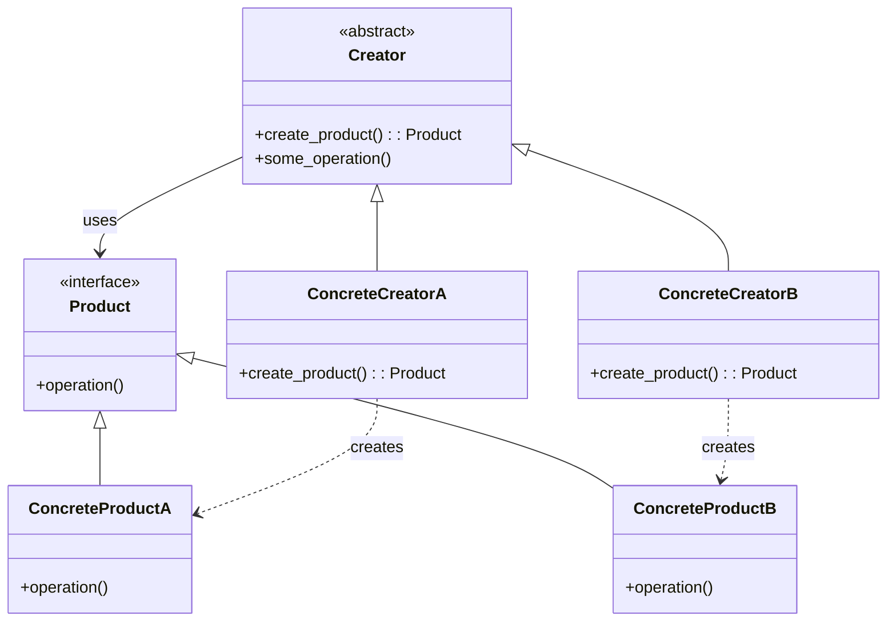
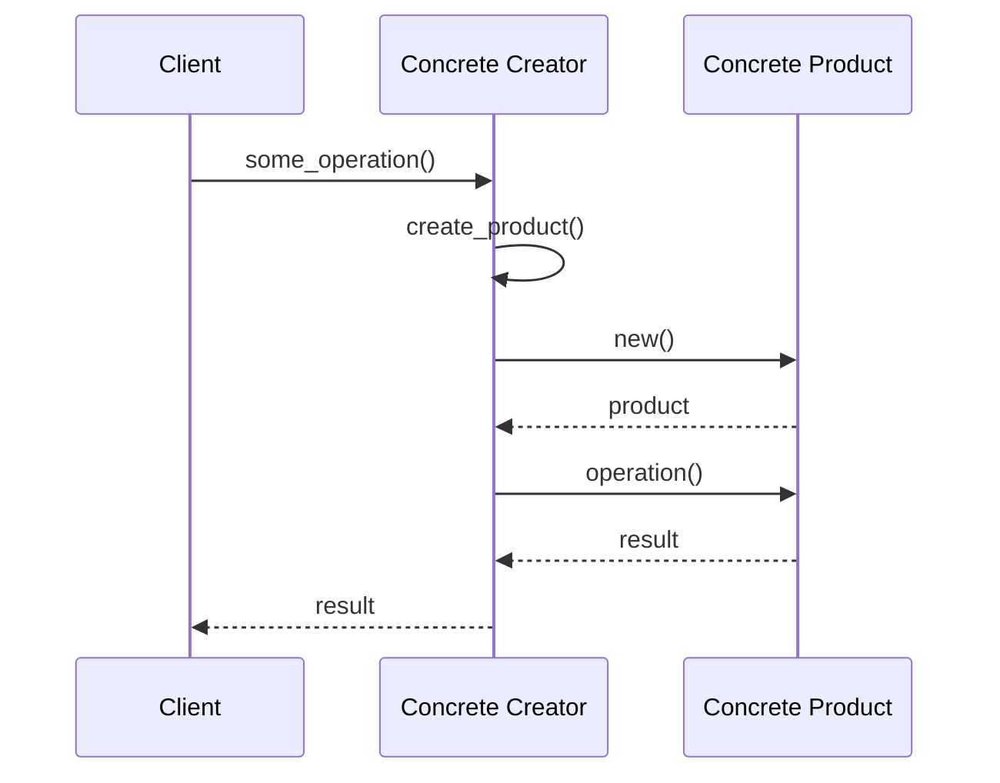
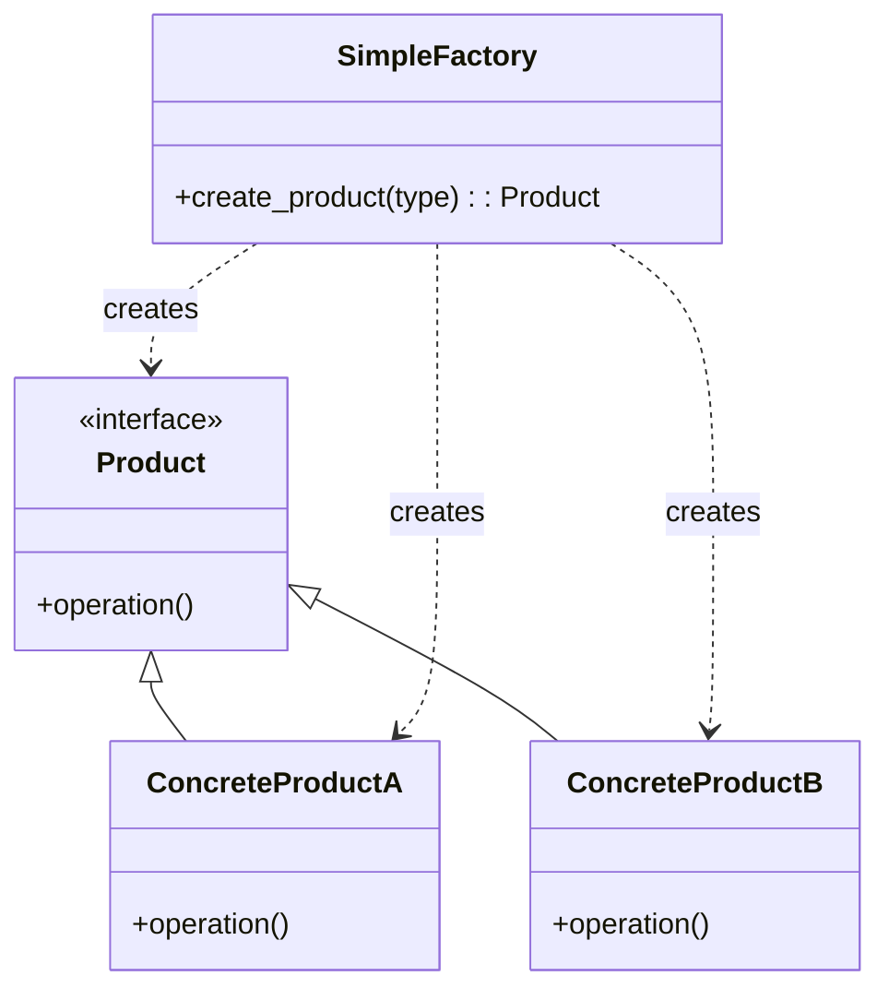
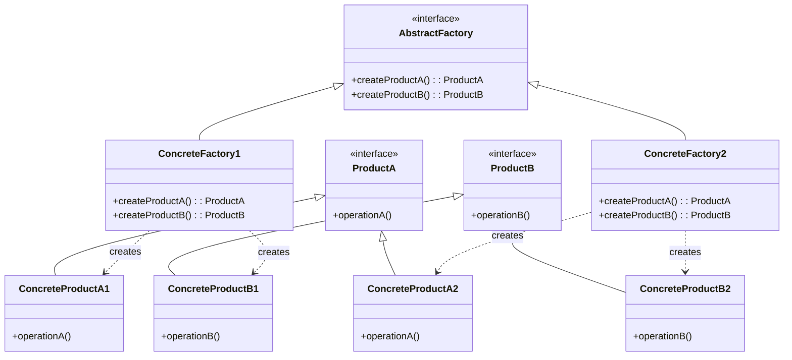

# Factory Pattern

The Factory Pattern is a creational design pattern that provides an interface for creating objects in a superclass, but allows subclasses to alter the type of objects that will be created. The Factory Method pattern suggests defining a method in a base class that lets subclasses decide which class to instantiate.

## Key Components

1. **Product**: The common interface for all objects that can be produced by the factory
2. **Concrete Products**: Specific implementations of the Product interface
3. **Creator/Factory**: Abstract class that declares the factory method
4. **Concrete Creators**: Subclasses that implement the factory method to create specific products

## Class Diagram

## Sequence Diagram

## Types of Factory Patterns

### Simple Factory (not a true pattern, but commonly used)
A simple factory is a static method that creates and returns objects based on some input parameters.

### Factory Method
As described above, uses inheritance and subclassing to decide which concrete product to create.

### Abstract Factory
Provides an interface for creating families of related or dependent objects without specifying their concrete classes.

## Benefits

- Provides a way to hide the creation logic from the client code
- Makes code more flexible, not tied to specific classes
- Allows for future extension by adding new products without changing existing code
- Follows the Open/Closed principle
- Creates objects through composition, rather than direct instantiation

## Example

In this example, we implement a document generator factory that can create different types of documents (PDF, Word, HTML) with a consistent interface.

## Further Reading

- [Refactoring Guru - Factory Method Pattern](https://refactoring.guru/design-patterns/factory-method)
- [Refactoring Guru - Abstract Factory Pattern](https://refactoring.guru/design-patterns/abstract-factory)
- [Python Design Patterns - Factory Pattern](https://python-patterns.guide/gang-of-four/factory-method/)
- [Real Python - Factory Method Pattern](https://realpython.com/factory-method-python/) 