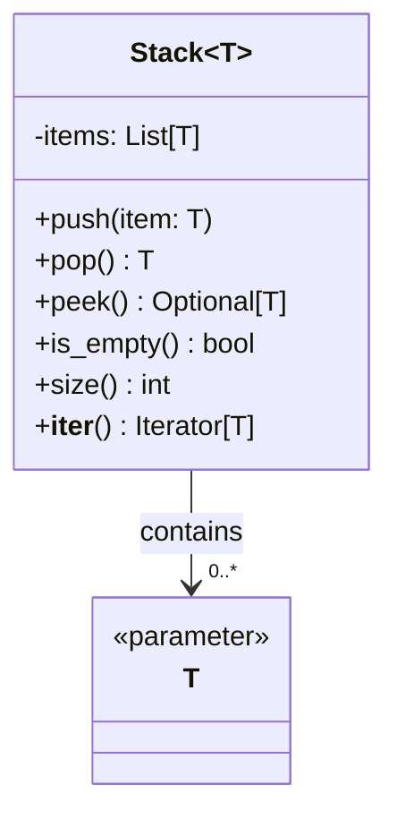
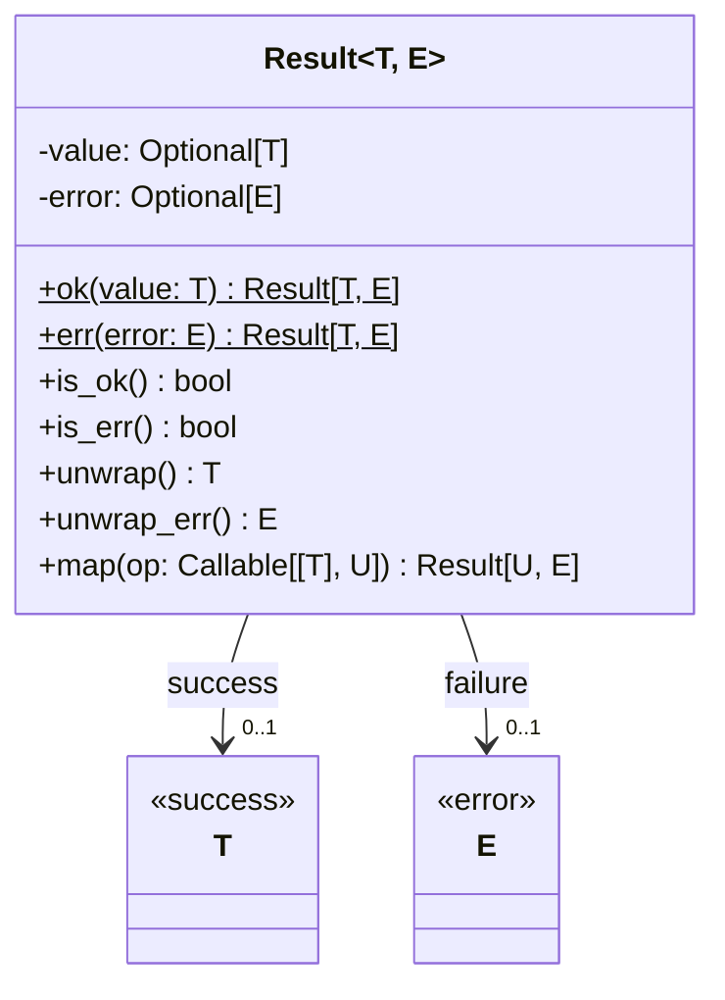

# Generics in Python

This section demonstrates the use of generics in Python using type hints and the `typing` module. We'll explore various aspects of generic programming through practical examples.

## Stack[T] - Generic Stack Implementation

### Diagram



### Overview

A generic stack implementation that can work with any type. Key features:
- Type-safe push and pop operations
- Optional peek that handles empty stacks
- Iterable interface for traversing elements
- Comprehensive string representations

## Result[T, E] - Generic Error Handling

### Diagram



### Overview

A type-safe error handling mechanism inspired by Rust's Result type. Key features:
- Explicit error handling without exceptions
- Type-safe success and error values
- Chainable operations with map and and_then
- Rich set of unwrap operations

## Implementation Details

We're implementing several generic types to demonstrate different aspects of generic programming:

1. **Stack[T]**: A generic stack data structure
   - Demonstrates basic generic class implementation
   - Shows type-safe operations on a collection
   - Implements standard container protocols

2. **Result[T, E]**: A type-safe error handling mechanism
   - Shows multiple type parameters
   - Implements the Railway-oriented programming pattern
   - Provides a functional approach to error handling

3. **Repository[T]**: A generic data access interface _(Coming Soon)_
   - Demonstrates generic protocols
   - Shows bounded type parameters
   - Implements the Repository pattern

4. **Cache[K, V]**: A generic key-value cache _(Coming Soon)_
   - Shows multiple type parameters with different roles
   - Implements time-based expiration
   - Demonstrates type constraints

## Example Usage

```python
# Stack Example
numbers = Stack[int]()
numbers.push(1)
numbers.push(2)
top = numbers.pop()  # type: int

# Result Example
def divide(a: float, b: float) -> Result[float, str]:
    if b == 0:
        return Result.err("Division by zero")
    return Result.ok(a / b)

result = divide(10, 2)
if result.is_ok():
    value = result.unwrap()  # type: float
```

## Running the Examples

To run the demonstration:

```bash
python -m generics.main
```

## Running Tests

To run the tests with type checking:

```bash
python -m pytest --mypy
```

## Best Practices

1. **Type Variable Naming**
   - Use single uppercase letters (T, K, V) for simple type variables
   - Use descriptive names for complex types (Key, Value, Error)

2. **Constraints**
   - Use bounded type variables when operations require specific methods
   - Document type constraints in docstrings

3. **Error Handling**
   - Return Optional[T] when operations can fail
   - Use Result[T, E] for operations with error details

4. **Documentation**
   - Document type parameters in class and function docstrings
   - Include examples with type annotations

## Requirements

- Python 3.11+
- mypy
- pytest 