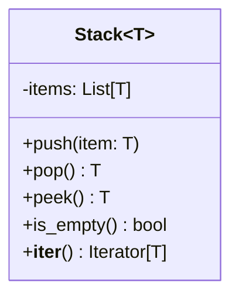
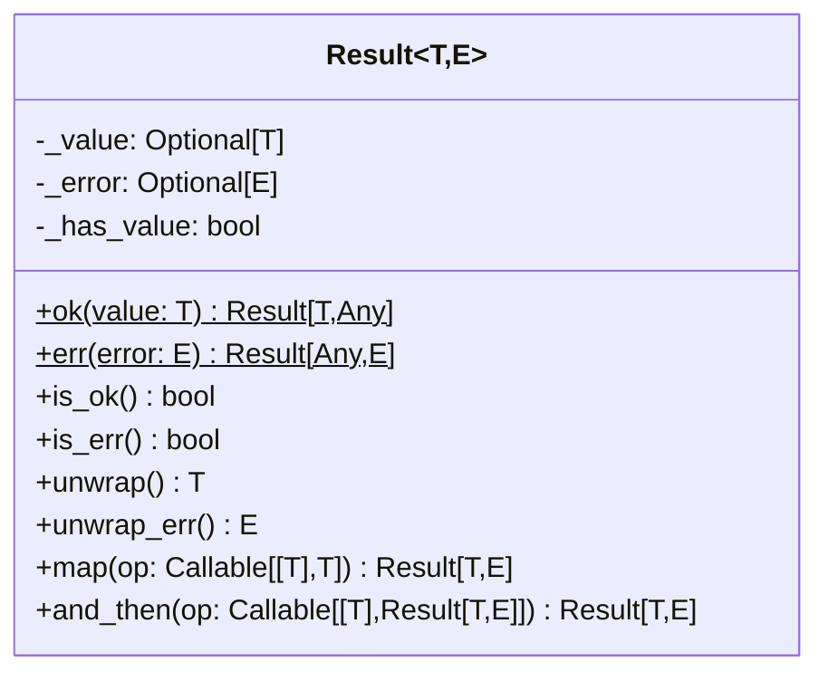
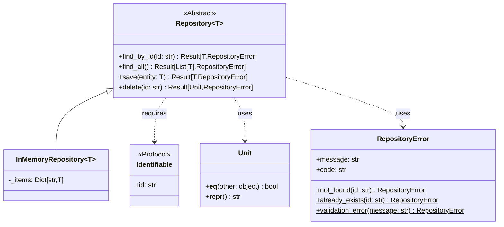

# Python Generic Types Examples

This project demonstrates the implementation of generic types in Python, showcasing type-safe programming patterns commonly found in languages like Rust and Scala.

## Implementations

### Stack[T]

A generic stack implementation that can hold elements of any type. The stack is implemented using a list and provides type-safe operations.



Features:
- Type-safe push and pop operations
- Peek at the top element without removing it
- Iterator support for traversing elements
- Empty stack handling with descriptive errors

### Result[T, E]

A type-safe error handling mechanism similar to Rust's Result type. It represents either success (Ok) or failure (Err).



Features:
- Type-safe error handling without exceptions
- Method chaining with `map` and `and_then`
- Default value handling with `unwrap_or` and `unwrap_or_else`
- Custom error messages with `expect` and `expect_err`
- Proper handling of `None` values with clear error messages

### Repository[T]

A generic repository pattern implementation with bounded type parameters and protocols.



Features:
- Type-safe repository operations with bounded type parameters
- Protocol-based interface for entities with IDs
- Comprehensive error handling using `Result` type
- Unit type for void operations (e.g., delete)
- In-memory implementation for testing and examples

## Usage Examples

The project includes comprehensive examples and tests demonstrating:

1. Stack operations with different types:
   - Integer stacks for numeric operations
   - String stacks for text processing
   - List stacks for complex data structures

2. Result type for error handling:
   - Division with zero checks
   - String parsing with error handling
   - Operation chaining with `map` and `and_then`

3. Repository pattern with generic types:
   - CRUD operations with type safety
   - Error handling for common scenarios
   - Working with multiple entity types
   - Validation and business logic examples

## Running the Examples

```bash
# Run all tests
PYTHONPATH=. python -m pytest -v

# Run the main examples
python -m generics.main
```

## Design Decisions

1. **Immutable Entities**: Entity classes (e.g., `User`, `Post`) are implemented as frozen dataclasses to ensure thread safety and enable use in sets and as dictionary keys.

2. **Unit Type**: Instead of using `None` for void operations, we use a proper `Unit` type to make the absence of a return value explicit and type-safe.

3. **Result Type**: Our `Result` implementation enforces proper initialization and provides clear error messages when misused. It supports both value and error type parameters for maximum flexibility.

4. **Type Safety**: All implementations use Python's type hints and generics to provide compile-time type checking when used with a type checker like mypy.

## Contributing

Feel free to contribute by:
1. Adding new generic type implementations
2. Improving existing implementations
3. Adding more examples and test cases
4. Enhancing documentation

Please ensure all tests pass and add appropriate documentation for new features. 