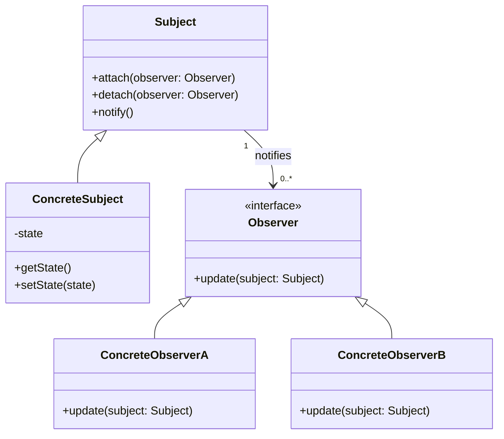

# Observable Pattern Implementation in Python

The Observable Pattern (also known as Publisher-Subscriber or Pub-Sub) is a behavioral design pattern where an object, called the subject (or publisher), maintains a list of its dependents, called observers (or subscribers), and notifies them automatically of any state changes, usually by calling one of their methods.

## Diagram



## Overview

The Observable Pattern defines a one-to-many dependency between objects so that when one object changes state, all its dependents are notified and updated automatically. It's particularly useful when:

- An object's state change should trigger changes in other objects without tight coupling
- The exact set of objects to be notified isn't known in advance or can change dynamically
- An object needs to notify an open-ended number of other objects

## Implementation Details

This implementation demonstrates the Observable Pattern in the context of a weather monitoring system:

1. **Subject (Observable)**: The base class/interface that maintains a list of observers and provides methods to add, remove, and notify observers.
   - `WeatherStation`: A concrete subject that tracks weather data and notifies observers when it changes.

2. **Observer**: The interface that defines the `update` method that concrete observers must implement.
   - `WeatherDisplay`: Abstract base class that implements the Observer interface.
   - Concrete Observers:
     - `CurrentConditionsDisplay`: Shows current temperature and humidity.
     - `StatisticsDisplay`: Shows min/max/avg temperature readings.
     - `ForecastDisplay`: Predicts future weather based on changes.
     - `HeatIndexDisplay`: Calculates and displays the heat index.

3. **Data and Events**: The data that the Subject maintains and for which it notifies Observers.
   - Weather data: temperature, humidity, pressure
   
## Key Concepts

- **Push vs. Pull Models**: This implementation demonstrates both approaches:
  - Push: The subject sends detailed data to observers in the notification.
  - Pull: Observers request the data they need from the subject when notified.

- **Subscription Management**: The subject allows observers to subscribe (attach) and unsubscribe (detach) dynamically.

- **Thread Safety**: Considerations for making the Observable pattern work safely in multithreaded environments.

## Example Usage

```python
# Create the subject
weather_station = WeatherStation()

# Create observers
current_display = CurrentConditionsDisplay(weather_station)
statistics_display = StatisticsDisplay(weather_station)
forecast_display = ForecastDisplay(weather_station)

# Weather station gets updated data
weather_station.set_measurements(80, 65, 30.4)
# All displays update automatically

# Can add/remove observers at any time
heat_index_display = HeatIndexDisplay(weather_station)
weather_station.set_measurements(82, 70, 29.2)
# Now heat index display is also updated

# Remove an observer
weather_station.remove_observer(forecast_display)
weather_station.set_measurements(78, 90, 29.2)
# Forecast display no longer receives updates
```

## Benefits

1. **Loose Coupling**: Subjects don't need to know anything about observers except that they implement the Observer interface.
2. **Broadcast Communication**: Allows sending data to multiple objects in a single call.
3. **Dynamic Relationships**: Observers can be added or removed at runtime.

## Design Considerations

1. **Notification Order**: Be cautious if observers depend on a specific notification order.
2. **Memory Leaks**: In languages without automatic garbage collection, observers might need to be explicitly detached to prevent memory leaks.
3. **Unexpected Updates**: Careful design is needed to prevent cascading updates or infinite notification loops.

## Running the Example

To run the demonstration:

```
python -m observable_pattern.main
```

## Running Tests

To run the tests:

```
python -m unittest discover -s observable_pattern/tests
``` 